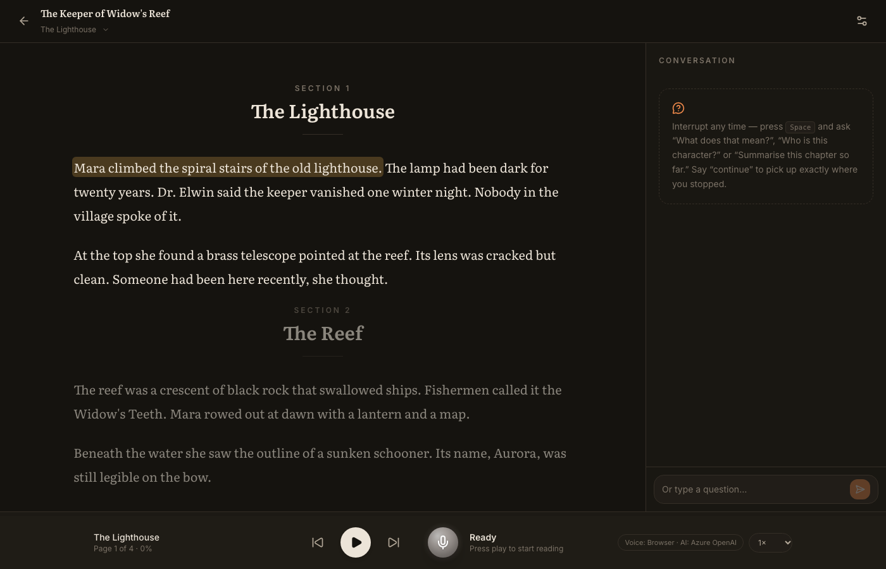

<div align="center">

# Lectern

**A voice-first AI book reader. It reads your PDFs aloud, and you can interrupt any time to ask about what you just heard.**

[](https://github.com/devarajasm/Lectern/actions/workflows/ci.yml)
[](https://github.com/devarajasm/Lectern/releases)
[](LICENSE)




</div>

---

Upload a book and press play. When something is unclear, interrupt: say *"Wait, what does that mean?"*. Lectern stops, looks at the passage you were hearing, and answers out loud. Say *"continue"* and it resumes at the sentence where you stopped.

```
READING ──(Space · tap the orb · just start talking)──▶ LISTENING ──▶ ANSWERING ──"continue"──▶ RESUMING ──▶ READING
```

## Features

- 🎧 **Natural narration.** Cloud voices (`marin`, `cedar`, …) are read paragraph by paragraph, with selectable narration styles (Storyteller, Calm, Expressive). The free browser voice works with no API key.
- ✋ **Interrupt any time.** Use push-to-talk (Space), tap the orb, or turn on hands-free mode and just start talking.
- 🧠 **Grounded answers.** Questions are answered from the current passage, its neighbours and relevant matches elsewhere in the book. The whole book is never sent to a model.
- 📍 **Exact resume.** Your position (chapter, page, chunk, sentence, character) is stored outside the model and survives restarts.
- 🔌 **Bring your own model.** Azure OpenAI, OpenAI, Ollama, LM Studio / vLLM / llama.cpp, or Hugging Face transformers in-process. Switch at runtime.
- 🔒 **Private by design.** Books and conversations stay on your machine, logs never contain book text, and cloud calls use `store=false`.
- 📄 **Copes with messy PDFs.** It strips running headers, page numbers and hyphenation, repairs word-per-line exports (calibre), drop caps and quote spacing, and detects chapters.

## Quick start

**Requirements:** Python 3.11+ and Node 20+. Chrome or Edge is recommended (best browser speech recognition).

```bash
git clone https://github.com/devarajasm/Lectern.git
cd Lectern
cp .env.example .env            # choose a provider and add its key, see Configuration

# Backend (terminal 1)
cd backend
python3 -m venv .venv && source .venv/bin/activate
pip install -r requirements.txt
uvicorn app.main:app --reload --port 8000

# Frontend (terminal 2)
cd frontend
npm install
npm run dev                     # open http://localhost:5173
```

**Run from a release, without Node:** download `lectern-vX.Y.Z.tar.gz` from [Releases](https://github.com/devarajasm/Lectern/releases). The UI comes prebuilt. Install the backend as above and open http://localhost:8000.

**No API key?** Pick **Browser voice** in Settings and a local model (Ollama or LM Studio). Everything then runs offline on your machine.

## Using it

| Action | How |
|---|---|
| Start / pause reading | Play button or **K** |
| Interrupt and ask | **Space**, or tap the orb. Press again when done (silence also ends it). |
| Resume | Say "continue", "go on" or "yes", or press play |
| Other commands | "stop", "repeat that", "start over" |
| Move around | **← / →** by sentence. Click any sentence. Use the progress bar or the section picker. |
| Type instead of talking | The box at the bottom of the conversation panel |

## Configuration

All settings live in `.env`; see [.env.example](.env.example) for every option. The **AI provider** is global. The default comes from `.env`, and you can switch it in **Settings → AI model provider**; that choice is saved locally.

| `LLM_PROVIDER` | Runs | You set |
|---|---|---|
| `azure` | cloud | `AZURE_OPENAI_ENDPOINT`, `AZURE_OPENAI_API_KEY`, `AZURE_OPENAI_*_DEPLOYMENT` |
| `openai` | cloud | `OPENAI_API_KEY`, `OPENAI_MODEL` |
| `ollama` | local | `ollama pull llama3.1:8b`, then `OLLAMA_MODEL` |
| `openai_compatible` | local | `OPENAI_COMPATIBLE_BASE_URL` (LM Studio, vLLM, llama.cpp, LocalAI) |
| `huggingface` | local, in-process | `pip install -r backend/requirements-local.txt`, then `HF_MODEL` |

**API details:**
- **Azure OpenAI** uses the v1 endpoint (`https://<resource>.openai.azure.com/openai/v1/`) with the Responses API. Model values are your *deployment names*. Set `AZURE_OPENAI_API_STYLE=chat` for deployments without Responses API support.
- **OpenAI** uses the Responses API.
- **Local servers** use Chat Completions.

**Voice** has two engines, switched in **Settings → Voice engine**:
- **Cloud voice:** `SPEECH_PROVIDER=azure|openai`, using `gpt-4o-mini-transcribe` and `gpt-4o-mini-tts`.
- **Browser voice:** the Web Speech API. Free and local.

If cloud speech fails or isn't configured, Lectern falls back to the browser engine automatically and tells you.

## How it works

```
PDF ─▶ extractor ─▶ chunker ─▶ SQLite + FTS5 ─▶ reading-state manager ─┐
                                                                        ├─▶ ModelProvider ─▶ text-to-speech
Mic ─▶ speech-to-text ─▶ conversation handler ─▶ context builder ──────┘
```

| Concern | Code |
|---|---|
| **PDF processing** | [backend/app/pdf/](backend/app/pdf/) |
| What it does | Extraction, cleanup, paragraph reflow, chapter detection, and sentence-aligned chunks of about 800 characters |
| **Storage** | [backend/app/storage/](backend/app/storage/) |
| What it does | SQLite at `data/app.db`, with an FTS5 index for retrieval |
| **Reading state** | [backend/app/reading/](backend/app/reading/) |
| What it does | Persisted after every sentence, independent of the LLM |
| **Context** | [backend/app/context/builder.py](backend/app/context/builder.py) |
| What it sends | The current passage with an interruption marker, neighbouring passages, the top-3 search hits and the last 6 turns. Capped at 12k characters. |
| **LLM** | [backend/app/llm/](backend/app/llm/) |
| What it does | `ModelProvider.generate(context, question)`, with a provider registry |
| **Speech** | [backend/app/speech/](backend/app/speech/) · [frontend/src/voice/](frontend/src/voice/) |
| What it does | `TTSEngine` / `STTEngine` interfaces, cloud and browser engines, automatic fallback |
| **Interruption and loop** | [frontend/src/agent/useReadingAgent.ts](frontend/src/agent/useReadingAgent.ts) · [backend/app/conversation/](backend/app/conversation/) |
| What it does | The client state machine, plus rule-based commands (instant, free) and LLM questions |

**Exact resume:** on interrupt, the client records the character offset reached. Word-boundary events give it on the browser voice; on cloud audio it is estimated from playback progress. The backend persists it. Reading restarts at the beginning of the sentence containing that offset.

## Privacy

- Books, reading state and conversations live in `./data` (git-ignored) on your machine.
- Logs contain IDs, counts, status codes and timings only. They never contain book text, questions, transcripts or answers.
- A question sends only the bounded context above to the active provider. Local providers keep everything on-device.
- Cloud voice sends narration text and your question audio to Azure/OpenAI. With browser voice, Chrome's speech recognition may use Google's servers.

## Troubleshooting

- **`502` from `/api/tts` or `/api/stt`.** The server log and the error message give the reason.
  - *TLS certificate verification failed*: Lectern trusts the OS certificate store, so add your proxy's root CA there, or set `EXTRA_CA_BUNDLE`.
  - *HTTP 404, check the deployment name*: an `AZURE_OPENAI_*_DEPLOYMENT` value doesn't exist on your resource.
- **Text is garbled or one word per line.** Update, then reprocess stored books in place: `cd backend && .venv/bin/python -m app.ingest`. Your position is kept.
- **No speech recognition in the browser.** Firefox and Safari lack the Web Speech recognition API. Use Chrome or Edge, use cloud voice, or type your question.

## Limitations

- No OCR. Scanned PDFs without a text layer are rejected.
- Hands-free interruption is energy-based. Use headphones; the first ~300 ms of speech isn't transcribed.
- No realtime speech-to-speech model yet. Speech-to-text, the LLM and text-to-speech are separate, swappable components.
- Single user, no authentication. Run it on your own machine (see [SECURITY.md](SECURITY.md)).

## Roadmap

- [ ] OCR for scanned PDFs
- [ ] EPUB support
- [ ] Streaming TTS for instant start
- [ ] Local speech engines (Whisper, Piper)
- [ ] Realtime speech-to-speech mode
- [ ] Docker image

## Contributing

Contributions are welcome! See [CONTRIBUTING.md](CONTRIBUTING.md) for setup, tests and the release process, and follow the [Code of Conduct](CODE_OF_CONDUCT.md). Report security issues privately, as described in [SECURITY.md](SECURITY.md). Release history is in the [CHANGELOG](CHANGELOG.md).

## License

Copyright © 2026 Devaraja S M.

Lectern is free software, licensed under the [GNU Affero General Public License v3.0](LICENSE). You may use, modify and redistribute it. If you run a modified version as a network service, you must offer your users its source code. Set `SOURCE_URL` so the app links to it.
